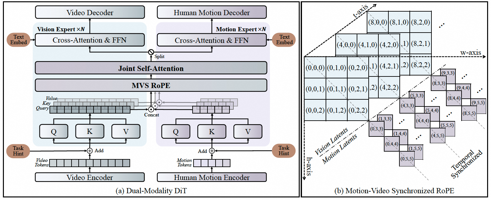

<h1 align="center">
  EchoMotion: Unified Human Video and Motion Generation via Dual-Modality Diffusion Transformer
</h1>

<h3 align="center">
  ICLR 2026
</h3>

<p align="center">
  <a href="https://yuxiaoyang23.github.io/EchoMotion-webpage/">
    
  </a>
  <a href="https://arxiv.org/abs/2512.18814">
    
  </a>
  <a href="https://github.com/D2I-ai/EchoMotion">
    
  </a>
  <a href="https://huggingface.co/Yuxiao319/EchoMotion">
    
  </a>
  <a href="https://github.com/D2I-ai/EchoMotion/extract_motion.py">
    
  </a>
  <a href="https://creativecommons.org/licenses/by-nc/4.0/">
    
  </a>
</p>


<!-- Author Information Section -->
<p align="center">
  <!-- Authors -->
  <a href="https://yuxiaoyang23.github.io/">Yuxiao Yang</a><sup>1,2</sup>&nbsp;&nbsp;&nbsp;&nbsp;
  <a href="https://scholar.google.com/citations?user=73JaDUQAAAAJ&hl=zh-CN">Hualian Sheng</a><sup>2</sup>&nbsp;&nbsp;&nbsp;&nbsp;
  <a href="https://scholar.google.com/citations?user=LMVeRVAAAAAJ&hl=en">Sijia Cai</a><sup>2,*</sup>&nbsp;&nbsp;&nbsp;&nbsp;
  <a href="https://jinglin7.github.io/">Jing Lin</a><sup>3</sup>
  <br>
  <a href="https://scholar.google.com/citations?user=zQnTBEoAAAAJ&hl=en">Jiahao Wang</a><sup>4</sup>&nbsp;&nbsp;&nbsp;&nbsp;
  <a href="https://scholar.google.com/citations?user=VQp_ye4AAAAJ&hl=zh-CN">Bing Deng</a><sup>2</sup>&nbsp;&nbsp;&nbsp;&nbsp;
  <a href="https://scholar.google.com/citations?user=907PxdcAAAAJ&hl=en">Junzhe Lu</a><sup>1</sup>&nbsp;&nbsp;&nbsp;&nbsp;
  <a href="https://scholar.google.com/citations?hl=zh-CN&user=eldgnIYAAAAJ&view_op=list_works&sortby=pubdate">Haoqian Wang</a><sup>1,†</sup>&nbsp;&nbsp;&nbsp;&nbsp;
  <a href="https://scholar.google.com/citations?user=T9AzhwcAAAAJ&hl=en">Jieping Ye</a><sup>2,†</sup>
  <br><br>
  <!-- Affiliations -->
  <sup>1</sup>Tsinghua University&nbsp;&nbsp;&nbsp;&nbsp;
  <sup>2</sup>Alibaba Group&nbsp;&nbsp;&nbsp;&nbsp;
  <sup>3</sup>Nanyang Technological University&nbsp;&nbsp;&nbsp;&nbsp;
  <sup>4</sup>Xi'an Jiaotong University
  <br>
  <!-- Legend -->
  <em><small><sup>*</sup>Project Lead&nbsp;&nbsp;&nbsp;&nbsp;<sup>†</sup>Corresponding Author</small></em>
</p>


**This is the official Github page of EchoMotion, the code has been released at [D2I-ai](https://github.com/D2I-ai/EchoMotion).**

## 💡 Abstract

> Video generation models have advanced significantly, yet they still struggle to synthesize complex human movements due to the high degrees of freedom in human articulation. This limitation stems from the intrinsic constraints of pixel-only training objectives, which inherently bias models toward appearance fidelity at the expense of learning underlying kinematic principles. To address this, we introduce **EchoMotion**, a framework designed to model the joint distribution of appearance and human motion, thereby improving the quality of complex human action video generation. EchoMotion extends the DiT (Diffusion Transformer) framework with a dual-branch architecture that jointly processes tokens concatenated from different modalities. Furthermore, we propose **MVS-RoPE (Motion-Video Synchronized RoPE)**, which offers unified 3D positional encoding for both video and motion tokens. By providing a synchronized coordinate system for the dual-modal latent sequence, MVS-RoPE establishes an inductive bias that fosters temporal alignment between the two modalities. We also propose a **Motion-Video Two-Stage Training Strategy**. This strategy enables the model to perform both the joint generation of complex human action videos and their corresponding motion sequences, as well as versatile cross-modal conditional generation tasks. To facilitate the training of a model with these capabilities, we construct ***HuMoVe***, a large-scale dataset of approximately 80,000 high-quality, human-centric video-motion pairs. Our findings reveal that explicitly representing human motion is complementary to appearance, significantly boosting the coherence and plausibility of human-centric video generation.

<p align="center">
  
</p>

<p align="center">
  <b>Overview of EchoMotion.</b> (a) The dual-modality DiT block for joint video-motion modeling. (b) Our MVS-RoPE to serve as a synchronized coordinate for dual-modal token sequence.
</p>

## ✨ Key Features

- **Joint Video & Motion Modeling**: Instead of just pixels, EchoMotion learns the relationship between appearance and underlying human motion, leading to more physically plausible results.
- **Novel Architecture**: Introduces a **Dual-Branch Diffusion Transformer** with **MVS-RoPE** for synchronized positional encoding, effectively aligning video and motion modalities.
- **Versatile Generation Tasks**: A single unified framework supports multiple tasks:
  - Text to Joint Video-and-Motion Generation
  - Motion-to-Video Generation
  - Video-to-Motion Prediction
- **New Large-Scale Dataset**: We introduce ***HuMoVe***, a high-quality dataset of ~80,000 video-motion pairs to facilitate research in this area.


## 🚀 Getting Started

> **📢 Code has been released at [D2I-ai](https://github.com/D2I-ai/EchoMotion).** See [README.md](https://github.com/D2I-ai/EchoMotion/) for more details.


## 📊 *HuMoVe* Dataset

Training a model like EchoMotion requires a large-scale, high-quality dataset of paired video and motion data. We introduce ***HuMoVe***, containing approximately 80,000 video-motion pairs.

- **Wide Category Coverage**: Spans a diverse range of human activities.
- **High-Quality Annotations**: Detailed text descriptions and precise SMPL motion sequences.
- **High-Fidelity Videos**: High-resolution, clean video clips.

Due to legal compliance restrictions, we are unable to release the complete video materials. Instead, we provide the full motion processing pipeline in [extract_motion.py](https://github.com/D2I-ai/EchoMotion/extract_motion.py). Text annotations can be generated using [Qwen-VL-Narrator](https://github.com/D2I-ai/Qwen-VL-Narrator).

## 📝 Citation

If you find our work useful for your research, please consider citing our paper:

```bibtex
@article{yang2025echomotion,
  title={EchoMotion: Unified Human Video and Motion Generation via Dual-Modality Diffusion Transformer},
  author={Yang, Yuxiao and Sheng, Hualian and Cai, Sijia and Lin, Jing and Wang, Jiahao and Deng, Bing and Lu, Junzhe and Wang, Haoqian and Ye, Jieping},
  journal={arXiv preprint arXiv:2512.18814},
  year={2025}
}
```

## 🙏 Acknowledgements

We would like to express our gratitude for the following projects and teams that were instrumental in the development of our work:

*   **[Qwen-VL-Narrator](https://github.com/D2I-ai/Qwen-VL-Narrator)**: For their excellent tool, which was used for the textual annotation of our ***HuMoVe*** dataset.
*   **[CameraHMR](https://camerahmr.is.tue.mpg.de/)**: For providing the robust framework used for the SMPL annotations in our dataset.
*   **[The Wan Team](https://github.com/Wan-Video)**: For their valuable open-source models that contributed to our research.


## 📜 License

This project is licensed under the [CC BY-NC 4.0](https://creativecommons.org/licenses/by-nc/4.0/legalcode.en) License. See the [LICENSE](LICENSE) file for more details.
